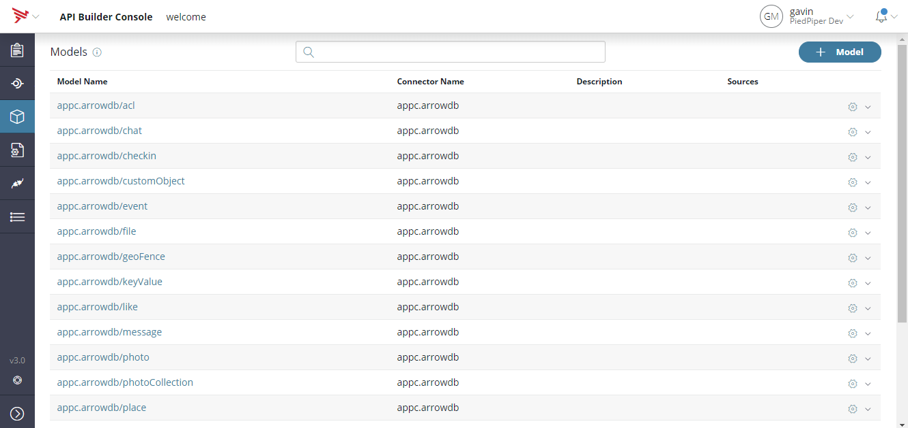
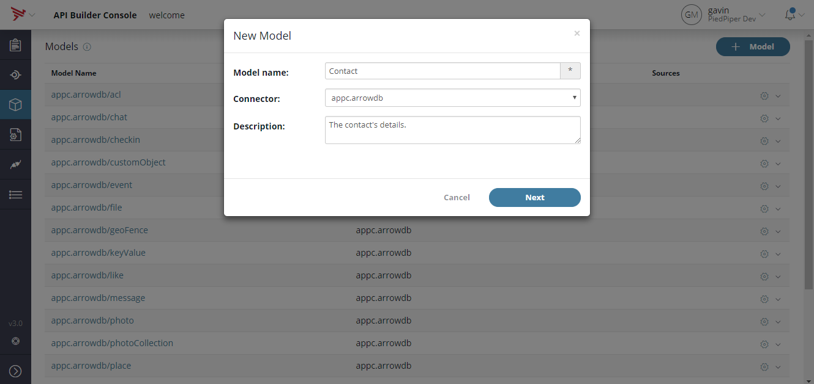

# API Builder Training 01

The goal here is to familiarize yourself with the models, endpoings and simple flow creation.

## Create a model
Open the Models page by clicking on the Cube in the navigation bar or browse to http://localhost:8080/console/project/models and click on the +Models button.

Create a "Contact" model.

Add the fields cid, firstname, lastname and salutation:

No need to create the APIs for the model as we'll generate flow based endpoints later.

Save the model.

## Generate the Model-First endpoints

## Create test data
