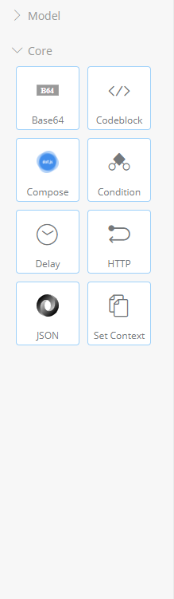
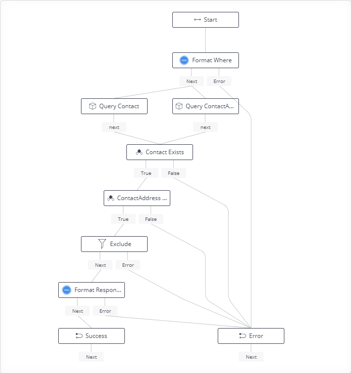
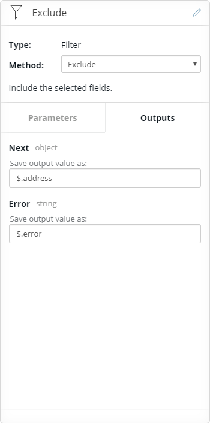
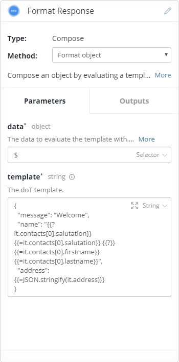

# 04 FlowSDK

Apart from the model nodes, API Builder only ships with a handfull of nodes.



It may seem that this may limit the complexity of flows that can be created. However API Builder is extensible, using the Axway Flow SDK users can create their own nodes to meet their own requirements.

The observant might have notice that in the previous exercise the address had an additional _id_ field, perhaps this is undesirable.

```
{
  "message": "Welcome",
  "name": "Mr. Bruce Wayne",
  "address": {
    "id": "5a15679493e7370284001471",
    "cid": "batman",
    "address1": "Wayne Manor",
    "address2": "107 Mountain Drive",
    "city": "Gotham City",
    "state": "New York",
    "country": "USA",
    "postalcode": "0"
  }
}
```

There are many ways to achieve this but for this example we'll create a node that clones an object but can filter the fields in the object. Then we'll update the flow to use this node to exclude the id from the address.

## Installation

The SDK is published to NPMJS and can be installed with:

```
w:\training\04_FlowSDK> npm install -g axway-flow-sdk
...
w:\training\04_FlowSDK> axway-flow

Usage: axway-flow [options]

Options:
   -n, --name          The name of the flow-node, e.g. "base64".
   -d, --description   Description of the flow-node handler (optional).
   -h, --help          This usage.
```

The  ```axway-flow``` command can now be used to create a _node_ project.

```
axway-flow -n gm-objectfilter
```

This will create a project called ```nodehandler-gm-objectfilter```.

## Implementing the nodes

The generated project comes with ready to build to make editing it much more intuitive. To start install the dependencies.

```
npm install
```

For this node there are no additional depenedency requirements but if there were they could be installed with ```npm install -S <name>```. The basic node project has 3 pieces - the node specification in _index.js_, the node implementation in _action.js_ and the the tests in _test_.

### Node Specification
Our example scenario requires a method that takes an object and a list of field names and outputs an object. For demonstration purposes we'll have two methods one that includes the specified fields and one that excludes them.

Name and description.
```
flownodes.add('gm-objectfilter', {
	name: 'Filter',
	icon: 'icon.svg',
	description: 'Filter the object fields.'
});
```

Include Method
```
flownodes
	.method('include', {
		name: 'Include',
		description: 'Include the selected fields.'
	})
	.parameter('source', {
		description: 'The source object to filter.',
		type: 'object'
	})
	.parameter('fields', {
		description: 'The the fields to include.',
		type: 'array',
		items: {
			type: 'string'
		}
	})
	.output('next', {
		name: 'Next',
		context: '$.filtered',
		schema: {
			type: 'object'
		}
	})
	.output('error', {
		name: 'Error',
		context: '$.error',
		schema: {
			type: 'string'
		}
	})
	.action(action.exclude);
```

Exclude Method
```
flownodes
	.method('exclude', {
		name: 'Exclude',
		description: 'Include the selected fields.'
	})
	.parameter('source', {
		description: 'The source object to filter.',
		type: 'object'
	})
	.parameter('fields', {
		description: 'The the fields to exclude.',
		type: 'array',
		items: {
			type: 'string'
		}
	})
	.output('next', {
		name: 'Next',
		context: '$.filtered',
		schema: {
			type: 'object'
		}
	})
	.output('error', {
		name: 'Error',
		context: '$.error',
		schema: {
			type: 'string'
		}
	})
	.action(action.exclude);
```

Node the _flownodes_ here follows a builder pattern and these are all chainable, they're just being broken down here for readbility.

### Implementation
One thing to be careful of here that is not obvious is that the object returned by _query_ is not plain data object, it has a custom toJson method that converts it to a plan data object. So to handle models aswell as other object be sure to stringify/parse the source object first.

```
function filter(req, include, cb) {
	const source = req.params.source;
	const fields = req.params.fields;
	if (!source || typeof source !== 'object') {
		return cb.error(null, 'Invalid source, object required.');
	} else if (!fields || !Array.isArray(fields)) {
		return cb.error(null, 'Invalid fields, array required.');
	}
	// JSON cloning to work with models better.
	const obj = JSON.parse(JSON.stringify(source));
	Object.keys(obj).forEach(field => {
		if ((!include && fields.includes(field))
			|| (include && !fields.includes(field))) {
			delete obj[field];
		}
	});
	cb.next(null, obj);
}
function include(req, cb) {
	filter(req, true, cb);
}
function exclude(req, cb) {
	filter(req, false, cb);
}
exports = module.exports = {
	include,
	exclude
};

```

Note also the usage of the callback _cb_. The callback has methods on it matching the outputs defined in _index.js_, in this case _error_ and _next_. So _cb.error_ is triggering the output named error:

```
return cb.error(null, 'Invalid source, object required.');
```

Whereas _cb.next_ is triggering the output named _next_:
```
cb.next(null, obj);
```

### Artistic Flair
The default icon is just a star:


Update this with something more appropriate to the node. This will currently be displayed at 28x28px so ensure it looks acceptable at that resolution.

## Installing locally
For testing purposes it's often useful to build the module locally and install the built module. To build the module:

```
npm run build
npm pack
```

Install the nodehandler into the Welcome app.
```
w:\training\04_FlowSDK\welcome>npm install -S ..\nodehandler-gm-objectfilter\nodehandler-gm-objectfilter-1.0.0.tgz
```

The restart the server and open the _Welcome_ flow http://localhost:8080/console/project/flows/welcome-Welcome/edit.

The new _Filter_ node is now present in the tool panel.


## Sharing

To share just publish to npmjs (or give someone the pack):
https://www.npmjs.com/package/nodehandler-gm-objectfilter

To install:
```
npm install -S nodehandler-gm-objectfilter
```

## Update the flow

The goal is to update the flow so that the filter node is inserted before the _Format Response_ and have it strip out the _id_ field from the address.



### Exclude
*Type:* Filter

*Method:* Exclude

The new extension node that is going to filter out the fields we don't want.

 

The node takes _$.addresses[0]_ as the source object and removes _cid_ and _id_ from it. The filtered object is saved as _$.address_ so the _Format Response_ node also needs to be updated for the change.


### Format Response
*Type:* Compose

*Method:* Format object



Change from _$.addresses[0]_ to _$.address_ in the template:

```
{
  "message": "Welcome",
  "name": "{{?it.contacts[0].salutation}}{{=it.contacts[0].salutation}} {{?}}{{=it.contacts[0].firstname}} {{=it.contacts[0].lastname}}",
  "address": {{=JSON.stringify(it.address)}}
}
```

## Test API

Save the updated flow and test the API using the _Test API_ panel. The address in the result should no longer have _cid_ or _id_.

```
{
  "message": "Welcome",
  "name": "Mr. Bruce Wayne",
  "address": {
    "address1": "Wayne Manor",
    "address2": "107 Mountain Drive",
    "city": "Gotham City",
    "state": "New York",
    "country": "USA",
    "postalcode": "0"
  }
}
```
